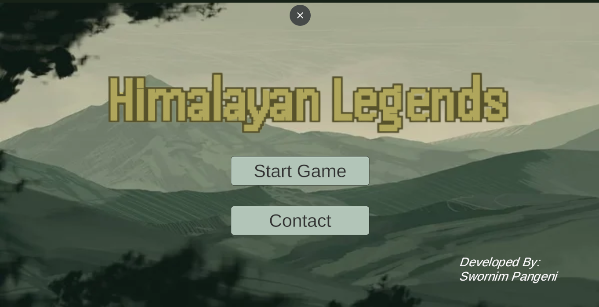
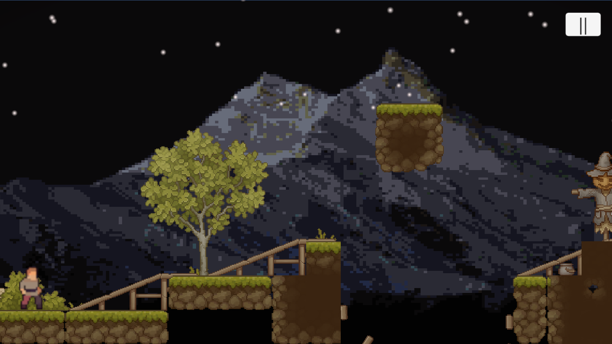

# Himalayan Legends

**Himalayan Legends** is an immersive WebGL game developed by **Swornim** using the Unity engine. Embark on thrilling adventures through the Himalayas, facing mythical creatures, challenging terrains, and uncovering ancient legends. 

## Features
- **Platform:** WebGL (runs in modern web browsers)
- **Compatibility:** Desktop and Mobile
- **Version:** 1.0
- **Fullscreen Support:** Yes

## How to Play

1. **Desktop:**
   - The game is optimized for a 960x600 windowed experience.
   - For fullscreen, click the fullscreen button in the game's footer.

2. **Mobile:**
   - Comming soon..........

## Development Details

- **Build Path:** The WebGL build files are located in the `Build` directory.
- **Streaming Assets:** Located in `StreamingAssets` for additional resources.
- **Main Files:**
  - `WebBuild.loader.js`
  - `WebBuild.data`
  - `WebBuild.framework.js`
  - `WebBuild.wasm`

## Installation & Hosting

To run the game locally or host it online, follow these steps:

1. **Local Testing:**
   - Use a local server (e.g., `http-server`, `Live Server` in VSCode, or Python's `http.server`) to serve the game.
   - Ensure all the build files are placed in a directory named `Build`.

2. **Hosting Online:**
   - Upload all files to your web hosting provider. Ensure the `Build` directory is correctly referenced.

## Unity Configuration

The game uses Unity’s WebGL export, with the following configuration:

- **Canvas Size:** 960x600 (Desktop)
- **Mobile Optimization:** Adjusts to mobile device dimensions automatically.
- **Rendering:** Managed by Unity’s WebGL instance.

## License

This game was developed by **Swornim** and is licensed under the MIT License. Feel free to fork, contribute, or adapt the game as needed.

---

Enjoy the adventure and explore the legends of the Himalayas!
